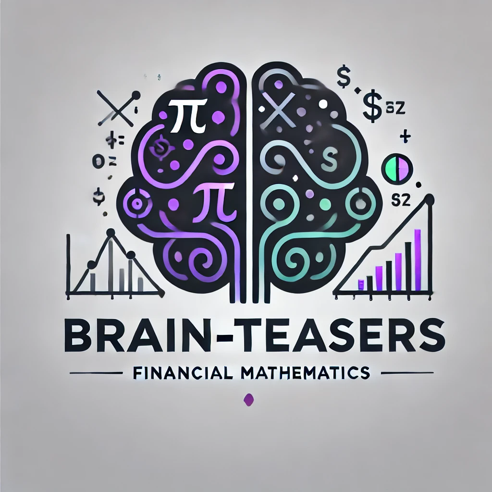

# Brain-Teasers

  

  Logo generated with assistance from OpenAI's DALL·E.

Welcome to **Brain-Teasers**, a collection of carefully selected problems in financial mathematics designed to showcase coding proficiency, mathematical insight, and problem-solving ability in the context of finance. 

## Purpose of the Project

This repository aims to:
- Demonstrate a deep understanding of financial mathematics and related concepts.
- Showcase my ability to design efficient algorithms for solving complex problems.
- Provide a platform for learning and exploring mathematical finance topics interactively.

## Current Problems

### 1. Cracking the Black-Box
