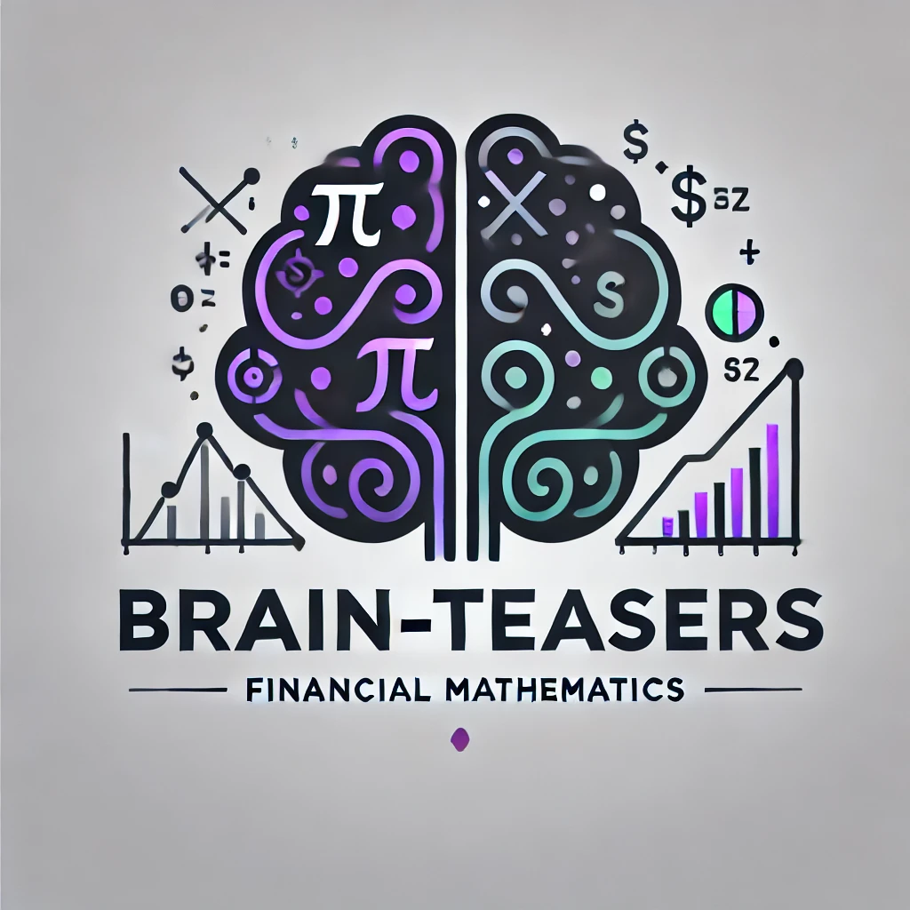

# Brain Teasers

  

  Logo generated with assistance from OpenAI's DALL·E.

Welcome to **Brain-Teasers**, a collection of carefully selected problems in financial mathematics designed to showcase coding proficiency, mathematical insight, and problem-solving ability in the context of finance. 

## Purpose of the Project

This repository aims to:
- Demonstrate a deep understanding of financial mathematics and related concepts.
- Showcase my ability to design efficient algorithms for solving complex problems.
- Provide a platform for learning and exploring mathematical finance topics interactively.

## Current Problems

### 1. [Cracking the Black-Box](1.Cracking_Black-Box.ipynb)
<table>
<tr>
<td>

A numerical challenge exploring implied volatility estimation through the use of a "black-box" function. This project combines financial mathematics, coding, and visualization to uncover hidden relationships in option pricing.

*Note*: Image was generated with assistance from OpenAI's DALL·E.

</td>
<td>

</td>
</tr>
</table>

### 2. [Randomly Signed Harmonic Series]
<table>
<tr>
<td>

A mathematical exploration of the harmonic series with randomly assigned signs, analyzed through the lens of martingale theory. This project demonstrates the almost sure convergence of the series and provides insights into its stochastic properties.

*Note*: Image was generated with assistance from OpenAI's DALL·E.

</td>
<td>

</td>
</tr>
</table>
